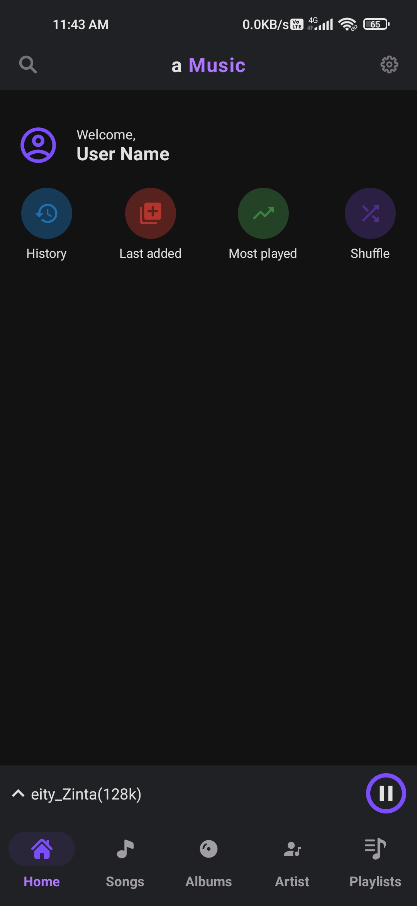
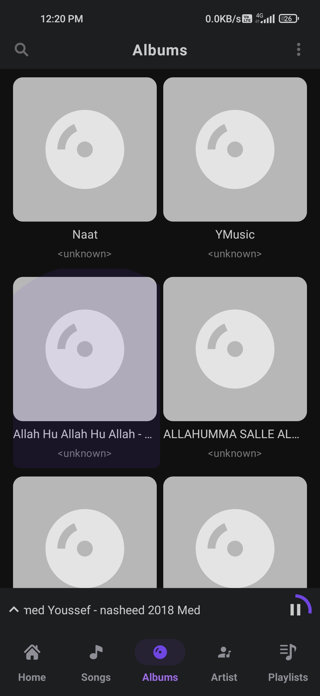
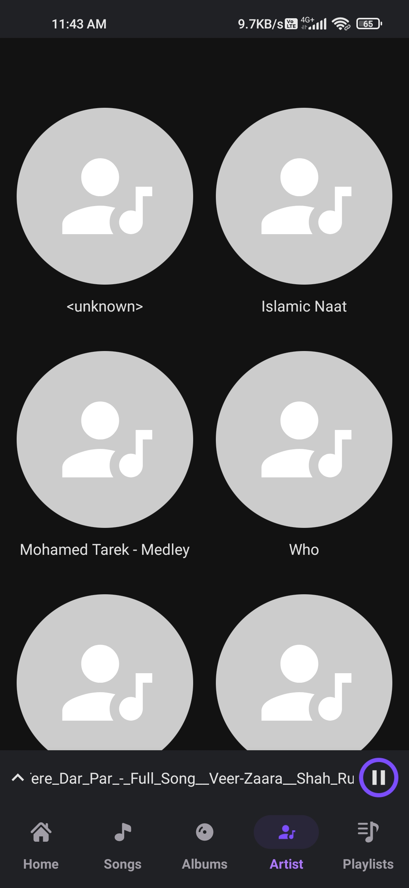
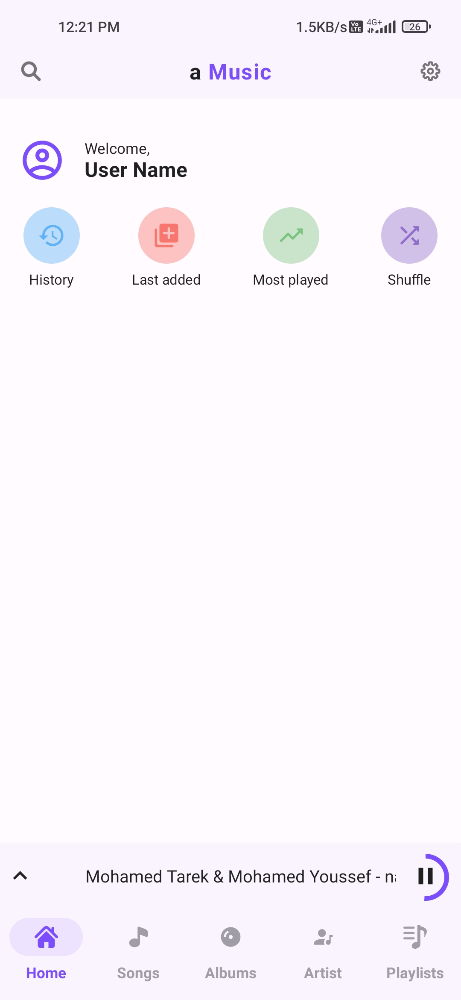
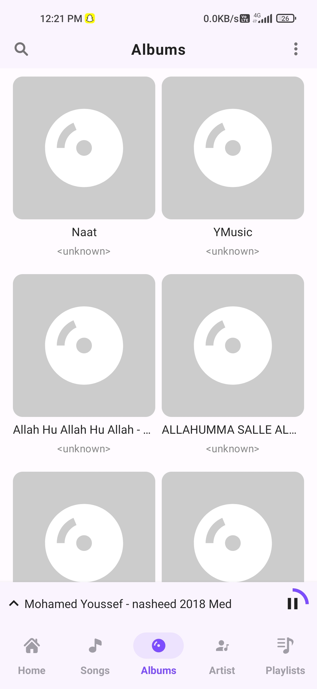
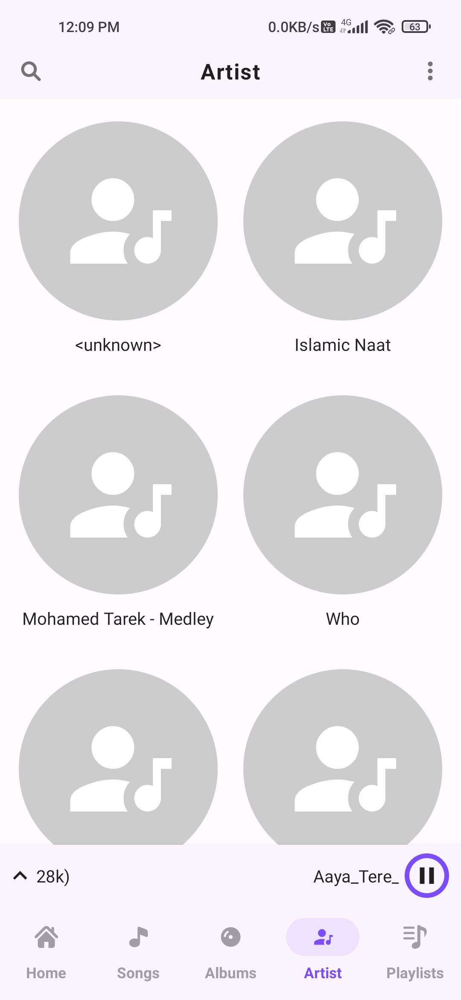
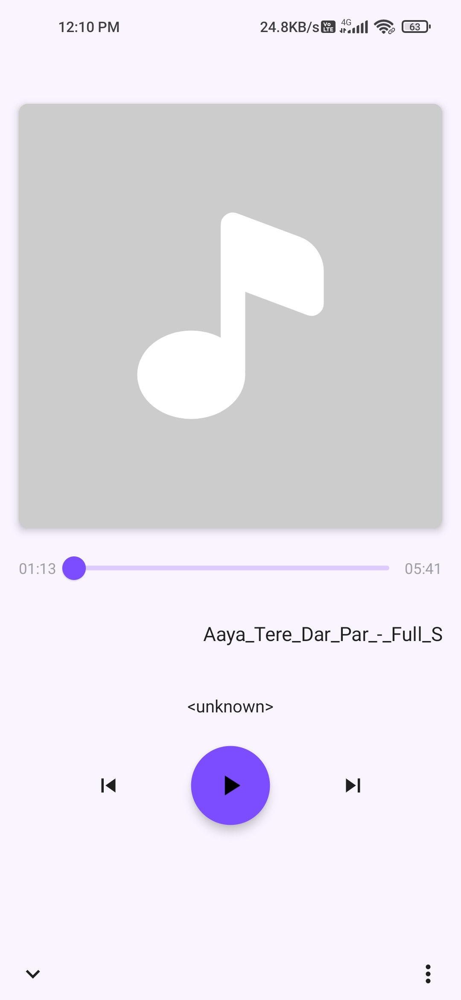

# aMusicPlayer
offline music player with jetpack compose and ExoPlayer.

## Features

- Clear App Architecture,Use Cases.
- Jetpack Compose UI. Custom animations, transitions, light/dark theme, and layouts.
- Jetpack Compose Navigation.
- Dependency injection with Hilt.
- Media can be playing in background using bound MediaBrowserCompatService
- Media style notifications.
- Uses a `MediaBrowserService` to control and expose the current media session.
- Plays Media that are there inside local storage.

## Libraries

- Jetpack Compose
- ExoPlayer
- Hilt
- Navigation
- ViewModel
- Accompanist-SystemUiController
- accompanist-page
- accompanist-permissions
- accompanist-navigation-animation

## Result

### Dark Mode

|  |  |  |  |  | 
 | 

|----------|:-------------:|:-------------:|:-------------:|

### Light Mode

|  |  |  |  |  | 
 | 

|----------|:-------------:|:-------------:|:-------------:|

### Demo
